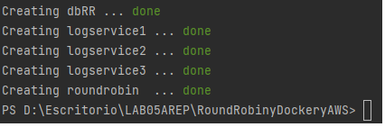

# RounRobin

## Despliegue en locahost

Lo primero que debemos hacer tras construir nuestro proyecto mvn en nuestro computador es desplegar nuestras imagenes y contenedores, para lo cual en nuestra linea de comandos nos ubicaremos en la carpeta raiz de nuestro proyecto y haremos uso del siguiente comando:

```
docker-compose up -d
```

El cual al finalizar de hacer la construcción de las imagenes y los contenedores nos mostrara en consola el siguiente resultado



En consola podemos revisar que nuestras imagenes se hayan creado con el siguiente comando

```
docker images
```

Que nos mostrara el siguiente resultado


Ahora vamos a mirar si los contenedores estan corriendo con el comando 

```
docker ps
```
Y nos da como resultado:


Ahora probamos entrar de manera local


## Despliegue en DockerHub 

Para realizar el despliegue en docker hub, se crea un repositorio para subir el proyecto para despues poder desplegar las imagenes en AWS

* Nombre de Usuario: amatiwsxD
* Nombre del Repositorio: roundrobin
* url: https://hub.docker.com/repository/docker/matiwsxd/roundrobin/general


Ahora vamos a cambiar el nombre de los tags para subirlos al repositorio y no tener confuciones.
Para ello vamos a usar los siguientes comando 

```
docker tag roundrobinydockeryaws_roundrobin:latest matiwsxd/roundrobin:roundrobin
```
```
docker tag roundrobinydockeryaws_logservice1:latest matiwsxd/roundrobin:logservice1
```
```
docker tag roundrobinydockeryaws_logservice2:latest matiwsxd/roundrobin:logservice2
```
```
docker tag roundrobinydockeryaws_logservice3:latest matiwsxd/roundrobin:logservice3
```
```
docker tag mongo:latest matiwsxd/roundrobin:mongo
```

Luego de cambiar los tags vamos a subir los contenedores al repositorio con los siguientes comandos 

```
docker push matiwsxd/roundrobin:roundrobin
```
```
docker push matiwsxd/roundrobin:logservice1
```
```
docker push matiwsxd/roundrobin:logservice2
```
```
docker push matiwsxd/roundrobin:logservice3
```
```
docker push matiwsxd/roundrobin:mongodb
```

Y verificamos que las imagenes esten subidas 


## Creacion Maquina en AWS
Para poder desplegar en AWS se debe crear una maquina virtual EC2, para esto nos dirigimos a la consola de
AWS e iniciarla y una vez iniciada se nos pondra en verde el indicador.

Le damos click en el indicador verde y nos enviara a la pagina donde podremos lanzar la maquina virtual
EC2 y en donde podemos seleccionar cualquiera de las opciones que dice apta para la capa.


Luego de eso nos va a mostrar un panel de EC2 donde veremos informacion general, como cuantas instancias tiene y los grupos de seguridad.


Creamos una nueva instancia y seleccionamos cualquiera de las siguientes imagenes:


Seleccionamos las caracteristicas aptas para la capa 


Recibimos la siguiente notificacion 


Nos conectamos mediante un cliente ssh a la maquina 


En el panel de general de EC2 modificamos los grupos de seguridad quedando asi: 


Instalamos Docker en la maquina 
   ```
      sudo yum install docker
   ```

Despues de instalar asignaremos al usuario docker permisos de administrador para no tener que usar el comando
sudo cada vez que se ejecute un comando docker

   ```
      sudo usermod -a -G docker ec2-user
   ```

Salimos de la maquina y volvemos a entrar para guardar los cambios+

Despues de volver a ingresar podemos iniciar el docker con el siguiente comando

   ```
      sudo service docker start
   ```

Luego usamos los siguientes comandos para descargar las imagenes del repositorio y ponerlos a correr 

   ```
docker run -d -p 35000:6000 --name roundrobin matiwsxd/roundrobin:roundrobin

   ```
   ```
docker run -d -p 35000:6000 --name roundrobin matiwsxd/roundrobin:logservice1
   ```
   ```
docker run -d -p 35000:6000 --name roundrobin matiwsxd/roundrobin:logservice2
   ```
   ```
docker run -d -p 35000:6000 --name roundrobin matiwsxd/roundrobin:logservice3
   ```
   ```
docker run -d -p 35000:6000 --name roundrobin matiwsxd/roundrobin:mongo
   ```

Revisamos que las imagenes esten en la maquina 

